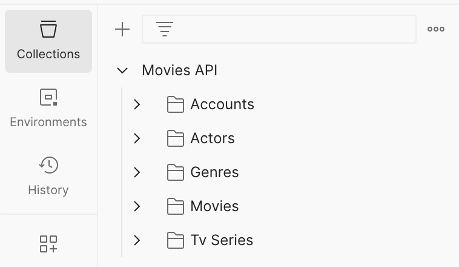
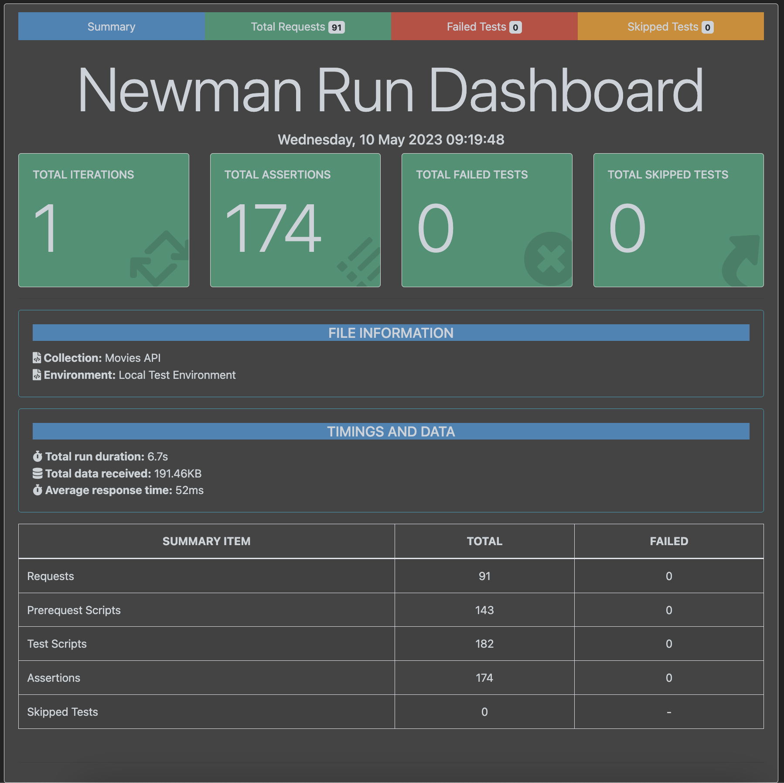
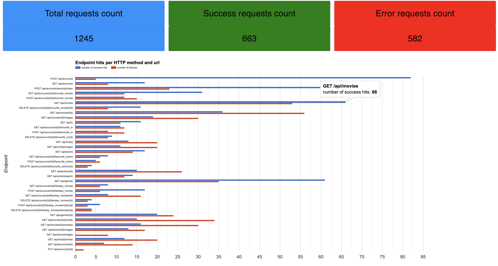
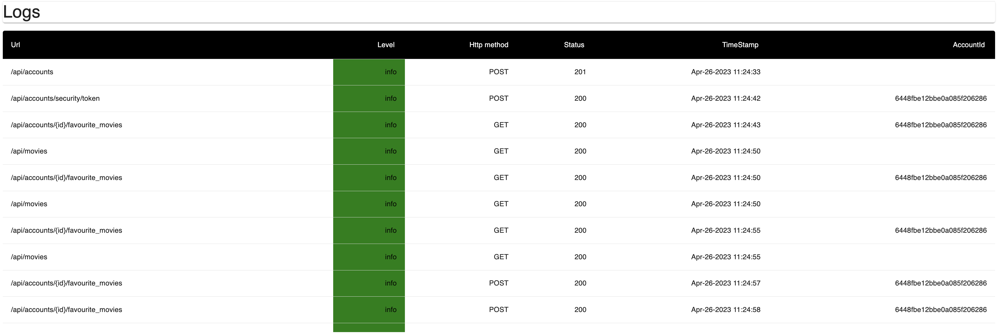

# Assignment 2 - Web API.

Name: Pawel Paszki

## Features.

### accounts

* delete from favourite movies: delete a TMDB movie ID (integer format) from favourite movies collection of the account

* add to favourite tv series: add a TMDB tv series ID (integer format) to favourite tv series collection of the account
  
* get favourite tv series: get an array of favourite tv series collection of the account

* delete from favourite tv series: delete a TMDB tv series ID (integer format) from favourite tv series collection of the account

* add to favourite actors: add a TMDB people ID (integer format) to favourite actors collection of the account

* get favourite actors: get an array of favourite actors collection of the account

* delete from favourite actors: delete a TMDB people ID (integer format) from favourite actors collection of the account
    
* add to fantasy movies: add new fantasy movie to the account's fantasy movies collection

* get fantasy movies: get account's fantasy movies collection
    
* get fantasy movie: get fantasy movie by its ID from account's fantasy movies collection
  
* add to fantasy movie cast: add cast member to a fantasy movie by ID

* delete fantasy movie: delete fantasy movie from account's fantasy movies collection

* delete fantasy movie cast: delete fantasy movie cast member from account's fantasy movie
    
### actors

* get actors: get popular people from TMDB (paginated)

* search actors: search for people using url query

* get person images: get images for person by their TMDB ID (integer format)

* get actor: get person from TMDB by TMDB people ID (integer format)
    
### logs
 
* get logs data structure: this is a route protected by different token (not accessible to authenticated accounts). it returns properly formatted data obtained from logs that is used by a small dashboard app to visualise this data
    
### movies
 
* get movie images: get images for the movie by the movie TMDB ID (integer format)

* get movie reviews: get reviews for the movie by the movie TMDB ID (integer format)

* find movie recommendations: get a list of recommended movies based on favourite movies of the account (or an empty list otherwise)

* find similar movies: get a list of similar movies (paginated) to the movie specified by url ID param (integer format)
    
### tv series

* find tv series recommendations: get a list of recommended tv series based on favourite tv series of the account (or an empty list otherwise)

* get tv series: get a list of TMDB tv series (paginated)

* find similar tv series: get a list of similar tv series (paginated) to the movie specified by url ID param (integer format)

## Installation Requirements

### Install mongodb 

([see here](https://www.mongodb.com/docs/manual/installation/)). Make sure that its running before commencing steps below.

### Clone the repo

```
git clone https://github.com/pawelpaszki/ewd-api-labs-2023.git
```

### Configure environment

Create and populate `.env` file (see [API Configuration](#api-configuration))

### Install npm dependencies

```bat
npm install
```

### Run the application

```
npm start
```

there should be no errors and output similar to this (note the last line in the output below that confirms successful database connection):

```
[nodemon] 2.0.21
[nodemon] to restart at any time, enter `rs`
[nodemon] watching path(s): *.*
[nodemon] watching extensions: js,mjs,json
[nodemon] starting `babel-node index.js`
Seeding genres to database
Server running at 8080
database connected to movies_db on localhost
```

## API Configuration

Following content must be placed in an `.env` file in the root of the repository. One addition to the labs is `LOGS_SECRET_KEY`, which will be used to decode a token sent to `/logs/analytics` route, which returns data structure used to visualize logs

```bat
NODE_ENV=development
PORT=8080
HOST=
DATABASE_DIALECT=mongo
TMDB_KEY=yourKey
DATABASE_URL=mongodb://localhost:27017/movies_db
JWT_SECRET_KEY=yourSecret
LOGS_SECRET_KEY=yourSecret
```


## API Design

Swagger docs for the API can be found [here](https://app.swaggerhub.com/apis/pawelpaszki-setu/ewd-api-labs-2023/0.1.0)

## Security and Authentication

All of the routes (apart from login/ sign up) are protected

Additionally, `/logs` API route is protected, so that only a requests with a token encrypted with the `LOGS_SECRET_KEY` (see [API Configuration](#api-configuration)) are allowed

## Validation

All url params used are validated using [paramsValidator](./src/utils/paramsValidator.js) and [custom errors](src/utils/errors/error-codes.js) are returned if the validation fails

## Testing

All API endpoints are tested using `newman`

Collections and environment created in Postman can be found [here](./tests)





## Integrating with React App

Slightly skimmed version of the react app (playlists removed from the original assignment 1 submission) is fully integrated with the node app. [Dedicated branch](https://github.com/pawelpaszki/labMoviesApp/tree/node-integration) was created to integrate both apps

~~~Javascript
import { createClient } from '@supabase/supabase-js'

const supabaseUrl = import.meta.env.VITE_REACT_APP_SUPABASE_URL;

const supabaseKey = import.meta.env.VITE_REACT_APP_SUPABASE_ANON_KEY;

const supabase = createClient(supabaseUrl, supabaseKey)

export const signup = (email, password, firstName, lastName) => {
  return fetch('/api/accounts', {
    headers: {
      'Content-Type': 'application/json'
    },
    method: 'post',
    body: JSON.stringify({ email: email, password: password, firstName: firstName, lastName: lastName })
  }).then((response) => {
    return response.json();
  })
    .catch((error) => {
      throw error
    });
};

export const login = (email, password) => {
  return fetch('/api/accounts/security/token', {
    headers: {
      'Content-Type': 'application/json'
    },
    method: 'post',
    body: JSON.stringify({ email: email, password: password })
  }).then(res => res.json())
};

export const getRecommendedMovies = (favouriteMovies) => {
  return fetch('/api/movies/recommended', {
    headers: {
      'Content-Type': 'application/json',
      'Authorization': window.localStorage.getItem('token')
    },
    method: 'post',
    body: JSON.stringify({ favouriteMovies: favouriteMovies })
  }).then(res => res.json())
};

export const getRecommendedTvSeries = (favouriteMovies) => {
  return fetch('/api/tv/recommended', {
    headers: {
      'Content-Type': 'application/json',
      'Authorization': window.localStorage.getItem('token')
    },
    method: 'post',
    body: JSON.stringify({ favouriteMovies: favouriteMovies })
  }).then(res => res.json())
};

export const addToFantasyMovies = async (title, overview, runtime, poster_path, productionCompanies, genres, releaseDate, file) => {
  await supabase.storage.from('tmdb').upload(poster_path, file);
  return fetch(`/api/accounts/${window.localStorage.getItem('accountId')}/fantasy_movies`, {
    headers: {
      'Content-Type': 'application/json',
      'Authorization': window.localStorage.getItem('token')
    },
    method: 'post',
    body: JSON.stringify({
      title: title,
      overview: overview,
      runtime: runtime,
      moviePoster: poster_path,
      productionCompanies: productionCompanies,
      genres: genres,
      releaseDate: releaseDate
    })
  }).then(res => res.json()).catch((error) => {
    console.error(error);
  });
};

export const addCastToFantasyMovie = async (movieId, name, roleName, avatar, description, file) => {
  await supabase.storage.from('tmdb').upload(avatar, file);
  return fetch(`/api/accounts/${window.localStorage.getItem('accountId')}/fantasy_movies/${movieId}/cast`, {
    headers: {
      'Content-Type': 'application/json',
      'Authorization': window.localStorage.getItem('token')
    },
    method: 'post',
    body: JSON.stringify({
      name: name,
      roleName: roleName,
      description: description,
      avatar: avatar
    })
  }).then(res => res.json()).catch((error) => {
    console.error(error);
  });
};

export const removeFromFantasyMoviesCast = async (movieId, castId, avatar) => {
  await supabase
    .storage
    .from('tmdb')
    .remove([avatar]);
  return fetch(`/api/accounts/${window.localStorage.getItem('accountId')}/fantasy_movies/${movieId}/cast/${castId}`, {
    headers: {
      'Content-Type': 'application/json',
      'Authorization': window.localStorage.getItem('token')
    },
    method: 'delete',
  }).then(response => {
    if (!response.ok) {
      throw new Error(response.json().message);
    }
    return {};
  })
};

export const getFantasyMovies = () => {
  return fetch(`/api/accounts/${window.localStorage.getItem('accountId')}/fantasy_movies`, {
    headers: {
      'Content-Type': 'application/json',
      'Authorization': window.localStorage.getItem('token')
    },
    method: 'get',
  }).then(res => res.json())
};

export const getFantasyMovie = (movieId) => {
  return fetch(`/api/accounts/${window.localStorage.getItem('accountId')}/fantasy_movies/${movieId}`, {
    headers: {
      'Content-Type': 'application/json',
      'Authorization': window.localStorage.getItem('token')
    },
    method: 'get',
  }).then(res => res.json())
};

export const removeFromFantasyMovies = async (movie) => {
  await supabase
    .storage
    .from('tmdb')
    .remove([movie.moviePoster]);
  for (let i = 0; i < movie.cast.length; i++) {
    await supabase
      .storage
      .from('tmdb')
      .remove([movie.cast[i].avatar]);
  }
  return fetch(`/api/accounts/${window.localStorage.getItem('accountId')}/fantasy_movies/${movie._id}`, {
    headers: {
      'Content-Type': 'application/json',
      'Authorization': window.localStorage.getItem('token')
    },
    method: 'delete',
  }).then(response => {
    if (!response.ok) {
      throw new Error(response.json().message);
    }
    return {};
  })
};

export const getFavouriteCollection = (collection) => {
  return fetch(`/api/accounts/${window.localStorage.getItem('accountId')}/favourite_${collection}`, {
    headers: {
      'Content-Type': 'application/json',
      'Authorization': window.localStorage.getItem('token')
    },
    method: 'get',
  }).then(res => res.json())
};

export const addToFavouriteCollection = (id, collection) => {

  return fetch(`/api/accounts/${window.localStorage.getItem('accountId')}/favourite_${collection}`, {
    headers: {
      'Content-Type': 'application/json',
      'Authorization': window.localStorage.getItem('token')
    },
    method: 'post',
    body: JSON.stringify({ id: id })
  }).then(res => res.json()).catch((error) => {
    console.error(error);
  });
};

export const removeFromFavouriteCollection = (id, collection) => {
  return fetch(`/api/accounts/${window.localStorage.getItem('accountId')}/favourite_${collection}/${id}`, {
    headers: {
      'Content-Type': 'application/json',
      'Authorization': window.localStorage.getItem('token')
    },
    method: 'delete',
  }).then(response => {
    if (!response.ok) {
      throw new Error(response.json().message);
    }
    return {};
  })
};

export const getSearchResults = (resource, query) => {
  let url = `/api/movies?vote_count.gte=200${query}`;
  if (resource === "tv") {
    url = `/api/tv?vote_count.gte=200&${query}`;
  }
  return fetch(
    url, {
    headers: {
      'Authorization': window.localStorage.getItem('token')
    }
  }
  ).then((response) => {
    if (!response.ok) {
      throw new Error(response.json().message);
    }
    return response.json();
  })
    .catch((error) => {
      throw error
    });
};

export const getSeries = (page = 1) => {
  return fetch(
    `/api/tv?page=${page}`, {
    headers: {
      'Authorization': window.localStorage.getItem('token')
    }
  }
  ).then((response) => {
    if (!response.ok) {
      throw new Error(response.json().message);
    }
    return response.json();
  })
    .catch((error) => {
      throw error
    });
};

export const getSimilarMovies = (page = 1, id) => {
  return fetch(
    `/api/movies/${id}/similar?page=${page}`, {
    headers: {
      'Authorization': window.localStorage.getItem('token')
    }
  }
  ).then((response) => {
    if (!response.ok) {
      throw new Error(response.json().message);
    }
    return response.json();
  })
    .catch((error) => {
      throw error
    });
};

export const searchActors = (query) => {
  return fetch(
    `/api/actors/search?query=${query}`, {
    headers: {
      'Authorization': window.localStorage.getItem('token')
    }
  }
  ).then((response) => {
    if (!response.ok) {
      throw new Error(response.json().message);
    }
    return response.json();
  })
    .catch((error) => {
      throw error
    });
};

export const getSimilarTvSeries = (page = 1, id) => {
  return fetch(
    `/api/tv/${id}/similar?page=${page}`, {
    headers: {
      'Authorization': window.localStorage.getItem('token')
    }
  }
  ).then((response) => {
    if (!response.ok) {
      throw new Error(response.json().message);
    }
    return response.json();
  })
    .catch((error) => {
      throw error
    });
};

export const getMovies = (page = 1) => {
  return fetch(
    `/api/movies?page=${page}`, {
    headers: {
      'Authorization': window.localStorage.getItem('token')
    }
  }
  ).then((response) => {
    if (!response.ok) {
      throw new Error(response.json().message);
    }
    return response.json();
  })
    .catch((error) => {
      throw error
    });
};

export const getMovie = (args) => {
  let id = ""
  if (args?.queryKey) {
    const [, idPart] = args.queryKey;
    id = idPart.id;
  } else {
    id = args.id;
  }
  return fetch(
    `/api/movies/${id}`, {
    headers: {
      'Authorization': window.localStorage.getItem('token')
    }
  }
  ).then((res) => res.json());
};

export const getTvSeriesById = (args) => {
  let id = ""
  if (args?.queryKey) {
    const [, idPart] = args.queryKey;
    id = idPart.id;
  } else {
    id = args.id;
  }
  return fetch(
    `/api/tv/${id}`, {
    headers: {
      'Authorization': window.localStorage.getItem('token')
    }
  }
  ).then((res) => res.json());
};

export const getPopularActors = (page = 1) => {
  return fetch(
    `/api/actors?page=${page}`, {
    headers: {
      'Authorization': window.localStorage.getItem('token')
    }
  }
  ).then((response) => {
    if (!response.ok) {
      throw new Error(response.json().message);
    }
    return response.json();
  })
    .catch((error) => {
      throw error
    });
};

export const getUpcomingMovies = (page = 1) => {
  return fetch(
    `/api/movies/upcoming?page=${page}`, {
    headers: {
      'Authorization': window.localStorage.getItem('token')
    }
  }
  ).then((response) => {
    if (!response.ok) {
      throw new Error(response.json().message);
    }
    return response.json();
  })
    .catch((error) => {
      throw error
    });
};

export const getActorDetails = (args) => {
  let id = ""
  if (args?.queryKey) {
    const [, idPart] = args.queryKey;
    id = idPart.id;
  } else {
    id = args.id;
  }
  return fetch(
    `/api/actors/${id}`, {
    headers: {
      'Authorization': window.localStorage.getItem('token')
    }
  }
  ).then((res) => res.json());
};

export const getGenres = async () => {
  return fetch(
    `/api/genres`, {
    headers: {
      'Authorization': window.localStorage.getItem('token')
    }
  }
  ).then((response) => {
    if (!response.ok) {
      throw new Error(response.json().message);
    }
    return response.json();
  })
    .catch((error) => {
      throw error
    });
};

export const getMovieImages = (args) => {
  const id = args.queryKey[1].id;
  return fetch(
    `/api/movies/${id}/images`, {
    headers: {
      'Authorization': window.localStorage.getItem('token')
    }
  }
  ).then((response) => {
    if (!response.ok) {
      throw new Error(response.json().message);
    }
    return response.json();

  })
    .catch((error) => {
      throw error
    });
};

export const getTvSeriesImages = (args) => {
  const id = args.queryKey[1].id;
  return fetch(
    `/api/tv/${id}/images`, {
    headers: {
      'Authorization': window.localStorage.getItem('token')
    }
  }
  ).then((response) => {
    if (!response.ok) {
      throw new Error(response.json().message);
    }
    return response.json();

  })
    .catch((error) => {
      throw error
    });
};

export const getActorImages = (args) => {
  const id = args.queryKey[1].id;
  return fetch(
    `/api/actors/${id}/images`, {
    headers: {
      'Authorization': window.localStorage.getItem('token')
    }
  }
  ).then((response) => {
    if (!response.ok) {
      throw new Error(response.json().message);
    }
    return response.json();

  })
    .catch((error) => {
      throw error
    });
};

export const getMovieReviews = (id) => {
  return fetch(
    `/api/movies/${id}/reviews`, {
    headers: {
      'Authorization': window.localStorage.getItem('token')
    }
  })
    .then((res) => res.json())
    .then((json) => {
      return json.results;
    })
    .catch((error) => {
      throw error
    })
};

~~~

[You can also add images of React app here also if you wish. This can be also shown in the video]

## Extra features

Extended error handling was developed, so that based on the error codes, different responses are returned on request failure. See [this folder](./src/utils/errors).

Node app is deployed on an ec2 instance, but for security purposes I won't share any details here. I will demonstrate it in the YouTube video.

## Independent learning.

### Analytics

Analytics app was created to parse the output of the `/logs/analytics` endpoint and present it to mimic a dashboard. See [this repo](https://github.com/pawelpaszki/MoviesApiAnalyticsDashboard)





### Images handling

Images for the fantasy movies and fantasy movies cast are stored in [supabase](https://app.supabase.com/). This was however copied from the first assignment. Not much of a learning curve here.

### Logging

Winston logging is implemented that logs both to a file and the console. Custom format is used so that the logs are ready to be processed by the analytics dashboard:

```
{method: request.method, url: formatUrl(request), status: status};
```

Additionally, url is formatted, so that all the url parameters are unified (e.g. actual account ids are displayed in the logs as `{id}`, this applies to all other ids too)

```
{"level":"info","message":{"accountId":"645b52cc23b3bb5011bbe8fd","method":"POST","status":200,"url":"/api/accounts/{id}/favourite_actors"},"timestamp":"May-10-2023 09:16:13"}
{"level":"error","message":{"method":"POST","status":400,"url":"/api/accounts/{id}/favourite_actors"},"timestamp":"May-10-2023 09:16:13"}
{"level":"error","message":{"method":"POST","status":401,"url":"/api/accounts/{id}/favourite_actors"},"timestamp":"May-10-2023 09:16:13"}
{"level":"info","message":{"accountId":"645b52cc23b3bb5011bbe8fd","method":"DELETE","status":200,"url":"/api/accounts/{id}/favourite_actors/{id}"},"timestamp":"May-10-2023 09:16:13"}
{"level":"error","message":{"method":"DELETE","status":401,"url":"/api/accounts/{id}/favourite_actors/{id}"},"timestamp":"May-10-2023 09:16:13"}
{"level":"info","message":{"accountId":"645b52cc23b3bb5011bbe8fd","method":"GET","status":200,"url":"/api/accounts/{id}/fantasy_movies"},"timestamp":"May-10-2023 09:16:13"}
{"level":"error","message":{"accountId":"dk39dk39dk39","method":"GET","status":404,"url":"/api/accounts/{id}/fantasy_movies"},"timestamp":"May-10-2023 09:16:13"}
{"level":"error","message":{"method":"GET","status":401,"url":"/api/accounts/{id}/fantasy_movies"},"timestamp":"May-10-2023 09:16:13"}
{"level":"error","message":{"method":"POST","status":401,"url":"/api/accounts/{id}/fantasy_movies"},"timestamp":"May-10-2023 09:16:13"}
{"level":"info","message":{"accountId":"645b52cc23b3bb5011bbe8fd","method":"POST","status":201,"url":"/api/accounts/{id}/fantasy_movies"},"timestamp":"May-10-2023 09:16:13"}
{"level":"info","message":{"accountId":"645b52cc23b3bb5011bbe8fd","method":"GET","status":200,"url":"/api/accounts/{id}/fantasy_movies/{id}"},"timestamp":"May-10-2023 09:16:13"}
```
